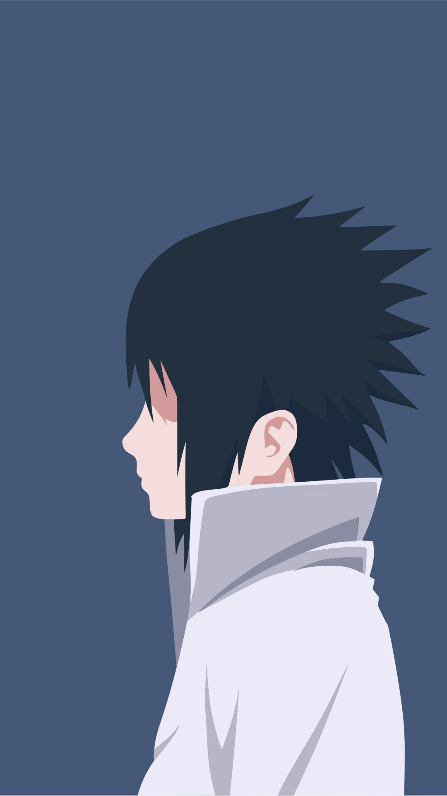

<!DOCTYPE html>
<html>
<head>
	<meta charset="utf-8">
	<title>Anime Waver</title>
	
</head>
<body>
	<header>
		

			

				
			

			

				<nav>
					<ul class="menu">
						<li>Home</li>
						<li>Features</li>
						<li>About</li>
						<li>Signup</li>
					</ul>
				</nav>
			

			

				<a href="#" class="getStartedBTN">Get Started</a>
			

		

	</header>
	

		

			

				<h1>A Place Where Someone Still Thinks of You</h1>
				
				

					<form>
						<h6>SIGN UP FOR A FREE TRAIL</h6>
						<input type="text" name="name" placeholder="Enter Your Name">
						<input type="email" name="email" placeholder="Email-Adderess">
						<button style="trial" type="submit" value="submit">Start Free Trail</button>
					</form>
				

			

		

		

			<h1 class="feature-section-title">Anime waver is an amazing landing page brought to you on everyone's favorite Anime webpage platform.</h1>
			

				

					
					<h3>Roy Mustang</h3>
					
"The world isn't perfect. But it's there for us, doing the best it can...that's what makes it so damn beautiful."

				

				

					
					<h3>Armin Arlert</h3>
					
"People, who can’t throw something important away, can never hope to change anything."

				

				

					
					<h3>Shintaro Midorima</h3>
					
"Don’t give up, there’s no shame in falling down! True shame is to not stand up again!"

				

			

		

		

			

				

					
				

				

					

						<h1 class="section-title">Naruto Uzumaki</h1>
						
"If you don't like your destiny, don't accept it 
						Instead, have the courage to change it the way you want it to be!"  
						Naruto Uzumaki is a fictional character in the manga and anime franchise Naruto, created by Masashi Kishimoto. Serving as the eponymous protagonist of the series, he is a young ninja from the fictional village of Konohagakure.

					

				

			

		

		

			

				

					

						<h1 class="section-title">Sasuke Uchiha</h1>
						
"Tears and rain, fall down on my face, my body is unable to stay yet my heart is unwilling to leave."  
						Sasuke Uchiha is a fictional character in the Naruto manga and anime franchise created by Masashi Kishimoto. Sasuke belongs to the Uchiha clan, a notorious ninja family, and one of the most powerful, allied with Konohagakure.

					

				

				

					
				

			

		

		

			

				

					<h1 class="action-title">What are you waiting for?</h1>
					
Get started today and try for free - No credit card required

					
<a href="#" class="signupBTN">Try Today</a>

				

			

		

		

			

				

					<h1 class="section-title" style="text-align: left;">Here what our fans have to say awesome</h1>
					
"Anime-Waver is an amazing webpage for weeb to view their thoughts. I couldn't be happier!"  <strong>-John Smith</strong>

				

			

			

				<form class="signupform">
					<h6>SIGN UP FOR A FREE 30 DAY TRAIL</h6>
					<input type="text" name="name" placeholder="Enter Your Name"> 
					<input type="email" name="email" placeholder="Email-Adderess"> 
					<button style="trail" type="submit" value="submit">Start Free Trail</button>
					
We don't share your personal info with anyone. Check out our <a href="#">Privacy Policy</a> for more information.
				
				</form>
			

		

	

	<footer>
		

			

				
			

		

		

			

				
			

		

		

			

				
			

		

		<h3 style="text-align: center; padding-top: 400px; color: black;">Anime-Waver</h3>
		&copy; Copyright 2020 Anime waver - Made with &hearts; Anime Weeb
	</footer>
</body>
</html>
